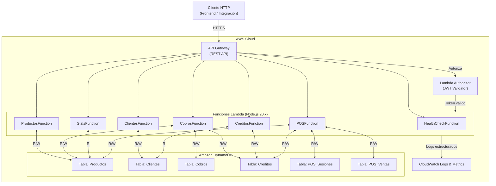
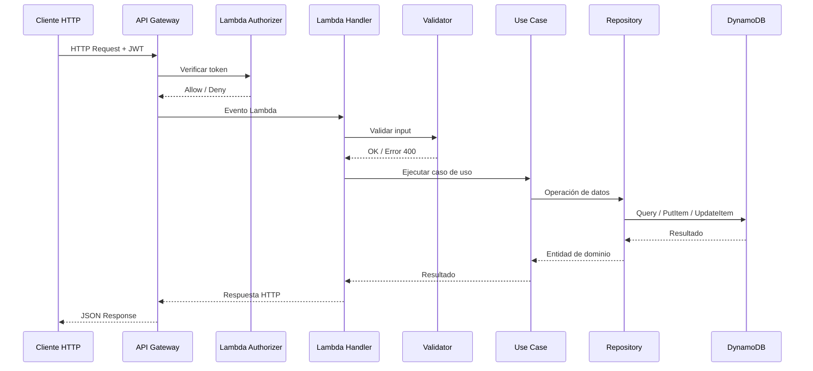
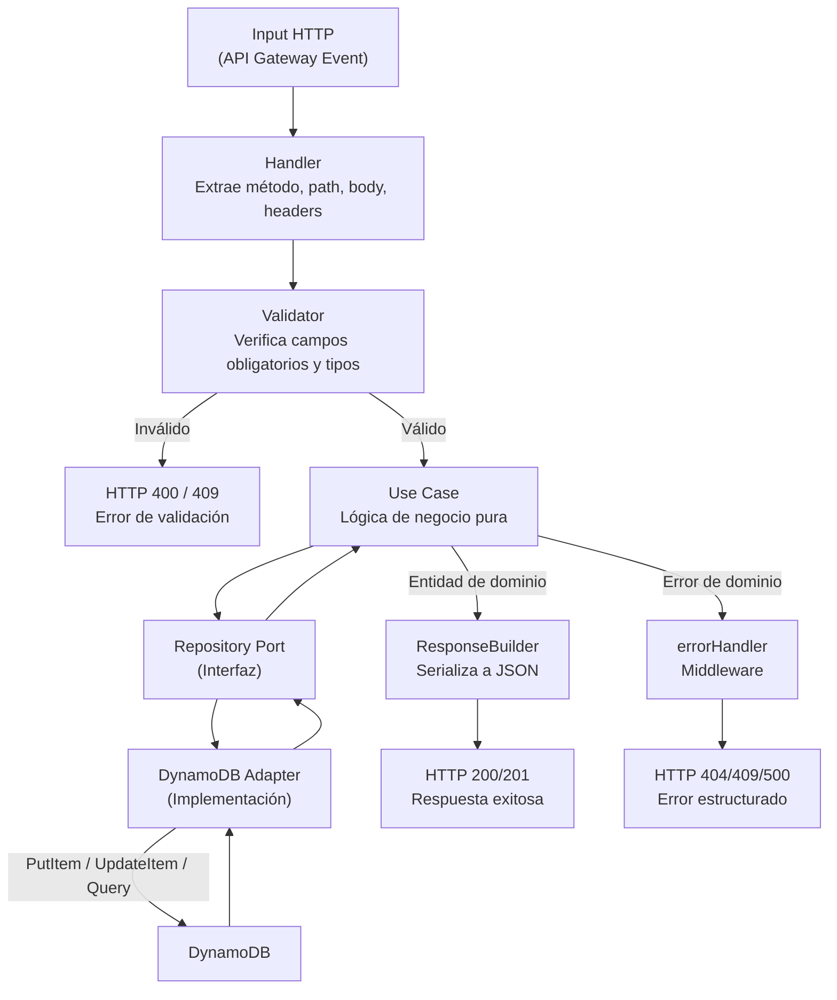

# Arquitectura del Sistema

## Visión General

La **Serverless Inventory API** es un sistema de gestión de inventario y punto de venta construido sobre AWS SAM. Expone una API REST a través de API Gateway, ejecuta lógica de negocio en funciones AWS Lambda (Node.js 20.x) y persiste datos en Amazon DynamoDB. El sistema sigue una **arquitectura hexagonal** con principios SOLID, separando claramente el dominio de negocio de los detalles de infraestructura.

### Objetivos de Diseño

- Separación estricta entre dominio, aplicación e infraestructura (Hexagonal Architecture)
- Cada módulo funcional es una Lambda independiente con responsabilidad única
- Validación centralizada en la capa de aplicación antes de tocar el dominio
- Respuestas de error consistentes en toda la API
- Escalabilidad automática mediante DynamoDB on-demand y Lambda concurrency

### Módulos del Sistema

| Módulo | Descripción |
|--------|-------------|
| Health Check | Estado y versión del sistema |
| Productos | CRUD del catálogo de inventario |
| Clientes | CRUD de compradores registrados |
| Cobros | Registro de transacciones de pago |
| Créditos | Saldos a favor de clientes |
| Estadísticas | Métricas e indicadores del inventario |
| POS | Sesiones de caja, ventas y tickets |

---

## Diagrama General

---

## Flujo de una Solicitud HTTP

---

## Ciclo de Vida del Dato (Logic Flow)

