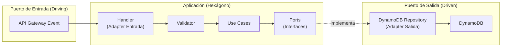
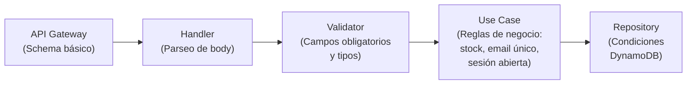

# Endpoints y Arquitectura Hexagonal

## Mapeo de Endpoints a Funciones Lambda

| Método | Ruta | Función Lambda | Caso de Uso |
|--------|------|----------------|-------------|
| GET | `/health` | HealthCheckFunction | — |
| GET | `/productos` | ProductosFunction | ListarProductos |
| POST | `/productos` | ProductosFunction | CrearProducto |
| PUT | `/productos/{id}` | ProductosFunction | ActualizarProducto |
| DELETE | `/productos/{id}` | ProductosFunction | EliminarProducto |
| GET | `/clientes` | ClientesFunction | ListarClientes |
| POST | `/clientes` | ClientesFunction | CrearCliente |
| GET | `/clientes/{id}` | ClientesFunction | ObtenerCliente |
| PUT | `/clientes/{id}` | ClientesFunction | ActualizarCliente |
| DELETE | `/clientes/{id}` | ClientesFunction | EliminarCliente |
| POST | `/cobros` | CobrosFunction | RegistrarCobro |
| GET | `/cobros/{id}` | CobrosFunction | ObtenerCobro |
| GET | `/cobros` | CobrosFunction | ListarCobrosPorCliente |
| POST | `/creditos` | CreditosFunction | RegistrarCredito |
| GET | `/creditos/{clienteId}` | CreditosFunction | ObtenerSaldoCredito |
| GET | `/stats` | StatsFunction | ObtenerEstadisticas |
| POST | `/pos/sesiones` | POSFunction | AbrirSesion |
| PUT | `/pos/sesiones/{sesionId}/cerrar` | POSFunction | CerrarSesion |
| GET | `/pos/sesiones/{sesionId}/ventas` | POSFunction | ListarVentasPorSesion |
| POST | `/pos/ventas` | POSFunction | RegistrarVenta |
| GET | `/pos/ventas/{ventaId}/ticket` | POSFunction | ObtenerTicket |

---

## Arquitectura Hexagonal — Ports y Adapters



---

## Ports (Interfaces) por Módulo

```javascript
// IProductoRepository.js
interface IProductoRepository {
  findAll(filters?: { categoria?: string }): Promise<Producto[]>
  findById(id: string): Promise<Producto | null>
  save(producto: Producto): Promise<Producto>
  update(id: string, data: Partial<Producto>): Promise<Producto>
  softDelete(id: string): Promise<void>
}

// IClienteRepository.js
interface IClienteRepository {
  findAll(): Promise<Cliente[]>
  findById(id: string): Promise<Cliente | null>
  findByEmail(email: string): Promise<Cliente | null>
  save(cliente: Cliente): Promise<Cliente>
  update(id: string, data: Partial<Cliente>): Promise<Cliente>
  softDelete(id: string): Promise<void>
}

// ICobroRepository.js
interface ICobroRepository {
  findById(id: string): Promise<Cobro | null>
  findByClienteId(clienteId: string): Promise<Cobro[]>
  save(cobro: Cobro): Promise<Cobro>
}

// ICreditoRepository.js
interface ICreditoRepository {
  findSaldoByClienteId(clienteId: string): Promise<number>
  save(credito: Credito): Promise<Credito>
  decrementarSaldo(clienteId: string, monto: number): Promise<number>
}

// ISesionRepository.js
interface ISesionRepository {
  findById(id: string): Promise<SesionDeCaja | null>
  findAbiertaByCajeroId(cajeroId: string): Promise<SesionDeCaja | null>
  save(sesion: SesionDeCaja): Promise<SesionDeCaja>
  update(id: string, data: Partial<SesionDeCaja>): Promise<SesionDeCaja>
}

// IVentaRepository.js
interface IVentaRepository {
  findById(id: string): Promise<Venta | null>
  findBySesionId(sesionId: string): Promise<Venta[]>
  save(venta: Venta): Promise<Venta>
}
```

---

## Estrategia de Validación por Capas


