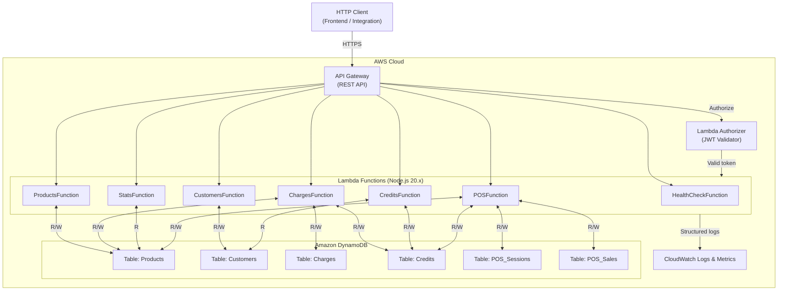
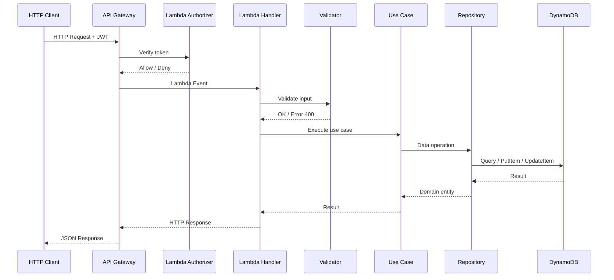
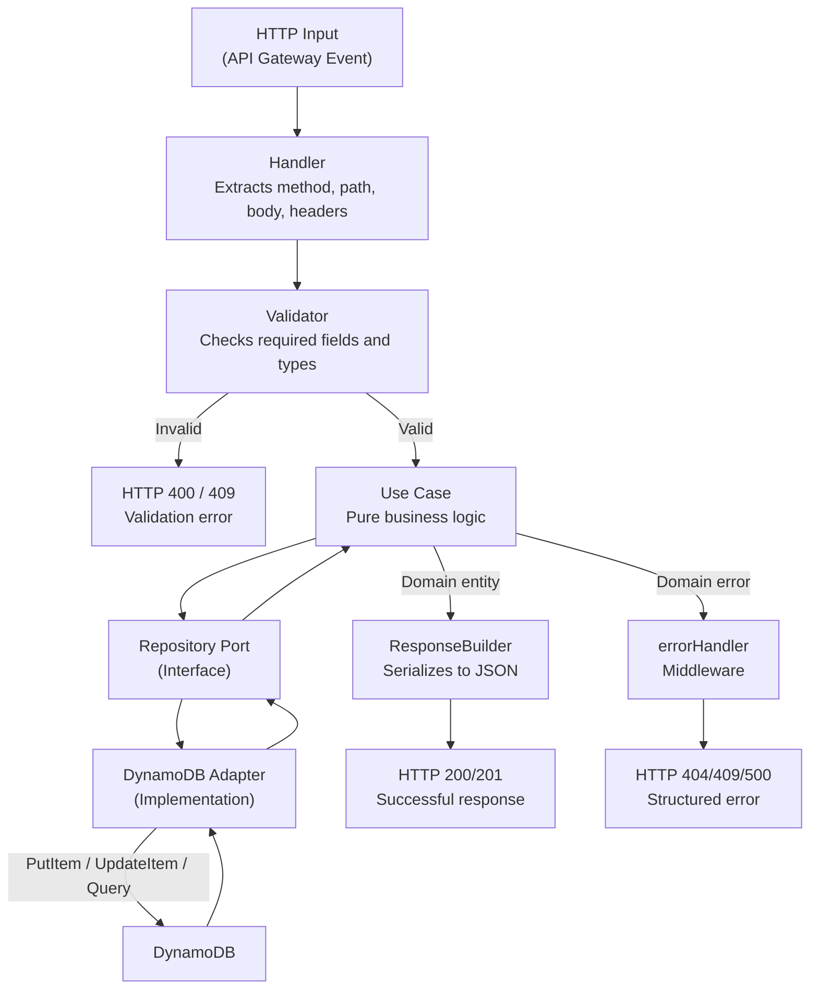

# System Architecture

## Overview

The **Serverless Inventory API** is an inventory management and point of sale system built on AWS SAM. It exposes a REST API through API Gateway, executes business logic in AWS Lambda functions (Node.js 20.x), and persists data in Amazon DynamoDB. The system follows **hexagonal architecture** with SOLID principles, clearly separating business domain from infrastructure details.

### Design Goals

- Strict separation between domain, application, and infrastructure (Hexagonal Architecture)
- Each functional module is an independent Lambda with single responsibility
- Centralized validation in the application layer before touching the domain
- Consistent error responses throughout the API
- Automatic scalability via DynamoDB on-demand and Lambda concurrency

### System Modules

| Module | Description |
|--------|-------------|
| Health Check | System status and version |
| Products | Inventory catalog CRUD |
| Customers | Registered buyers CRUD |
| Charges | Payment transaction registration |
| Credits | Customer credit balances |
| Statistics | Inventory metrics and indicators |
| POS | Cash sessions, sales, and tickets |

---

## General Diagram

---

## HTTP Request Flow

---

## Data Lifecycle (Logic Flow)

