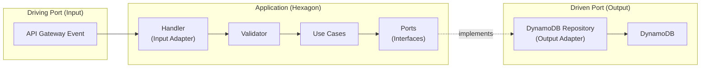
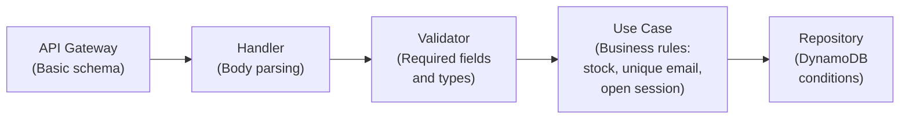

# Endpoints and Hexagonal Architecture

## Endpoint to Lambda Function Mapping

| Method | Route | Lambda Function | Use Case |
|--------|-------|-----------------|----------|
| GET | `/health` | HealthCheckFunction | — |
| GET | `/products` | ProductsFunction | ListProducts |
| POST | `/products` | ProductsFunction | CreateProduct |
| PUT | `/products/{id}` | ProductsFunction | UpdateProduct |
| DELETE | `/products/{id}` | ProductsFunction | DeleteProduct |
| GET | `/customers` | CustomersFunction | ListCustomers |
| POST | `/customers` | CustomersFunction | CreateCustomer |
| GET | `/customers/{id}` | CustomersFunction | GetCustomer |
| PUT | `/customers/{id}` | CustomersFunction | UpdateCustomer |
| DELETE | `/customers/{id}` | CustomersFunction | DeleteCustomer |
| POST | `/charges` | ChargesFunction | RegisterCharge |
| GET | `/charges/{id}` | ChargesFunction | GetCharge |
| GET | `/charges` | ChargesFunction | ListChargesByCustomer |
| POST | `/credits` | CreditsFunction | RegisterCredit |
| GET | `/credits/{customerId}` | CreditsFunction | GetCreditBalance |
| GET | `/stats` | StatsFunction | GetStatistics |
| POST | `/pos/sessions` | POSFunction | OpenSession |
| PUT | `/pos/sessions/{sessionId}/close` | POSFunction | CloseSession |
| GET | `/pos/sessions/{sessionId}/sales` | POSFunction | ListSalesBySession |
| POST | `/pos/sales` | POSFunction | RegisterSale |
| GET | `/pos/sales/{saleId}/ticket` | POSFunction | GetTicket |

---

## Hexagonal Architecture — Ports and Adapters



---

## Ports (Interfaces) by Module

```javascript
// IProductRepository.js
interface IProductRepository {
  findAll(filters?: { category?: string }): Promise<Product[]>
  findById(id: string): Promise<Product | null>
  save(product: Product): Promise<Product>
  update(id: string, data: Partial<Product>): Promise<Product>
  softDelete(id: string): Promise<void>
}

// ICustomerRepository.js
interface ICustomerRepository {
  findAll(): Promise<Customer[]>
  findById(id: string): Promise<Customer | null>
  findByEmail(email: string): Promise<Customer | null>
  save(customer: Customer): Promise<Customer>
  update(id: string, data: Partial<Customer>): Promise<Customer>
  softDelete(id: string): Promise<void>
}

// IChargeRepository.js
interface IChargeRepository {
  findById(id: string): Promise<Charge | null>
  findByCustomerId(customerId: string): Promise<Charge[]>
  save(charge: Charge): Promise<Charge>
}

// ICreditRepository.js
interface ICreditRepository {
  findBalanceByCustomerId(customerId: string): Promise<number>
  save(credit: Credit): Promise<Credit>
  decrementBalance(customerId: string, amount: number): Promise<number>
}

// ISessionRepository.js
interface ISessionRepository {
  findById(id: string): Promise<CashSession | null>
  findOpenByCashierId(cashierId: string): Promise<CashSession | null>
  save(session: CashSession): Promise<CashSession>
  update(id: string, data: Partial<CashSession>): Promise<CashSession>
}

// ISaleRepository.js
interface ISaleRepository {
  findById(id: string): Promise<Sale | null>
  findBySessionId(sessionId: string): Promise<Sale[]>
  save(sale: Sale): Promise<Sale>
}
```

---

## Validation Strategy by Layer


