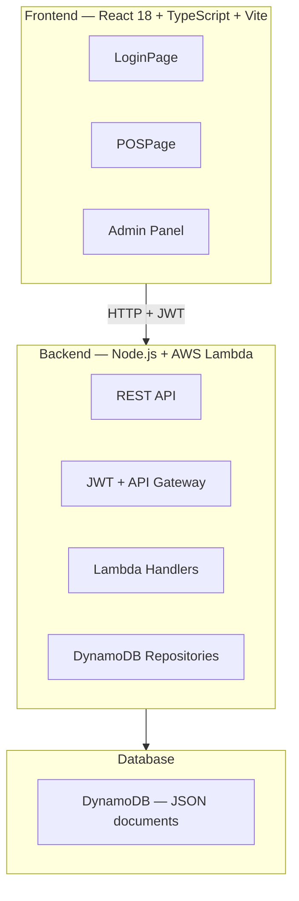
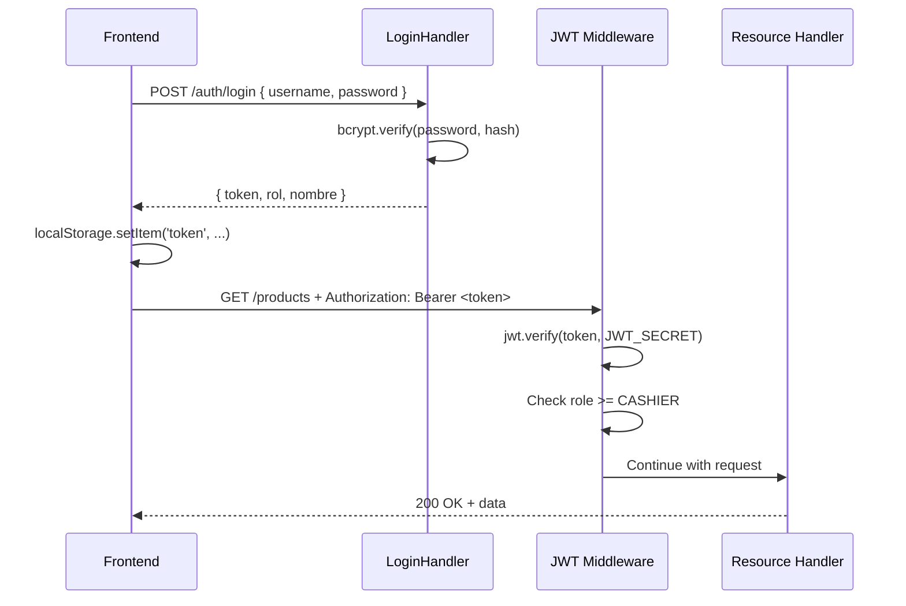

# Technical Design Document — Supermarket POS System

## Overview

A two-project system communicating via REST:



---

## Design Decisions

| Decision | Choice | Reason |
|----------|--------|--------|
| Frontend framework | React 18 + TypeScript | Mature ecosystem, static typing |
| Build tool | Vite | Fast HMR, Tailwind v4 support |
| Styles | Tailwind CSS v4 + Glassmorphism | Modern aesthetic, utility-first |
| POS state | useReducer | Complex cart with multiple actions |
| Keyboard shortcuts | Centralized `useKeyboardShortcuts` hook | Avoids conflicts between components |
| Backend framework | Node.js 20 + AWS Lambda (SAM) | Serverless, course-aligned |
| Security | JWT in API Gateway / Lambda | Standard tokens |
| Persistence | AWS DynamoDB | JSON documents, non-relational tables |
| Database | DynamoDB | No JOINs; sales with embedded `items[]` |

---

## Frontend

### Folder Structure

```
pos-frontend/
├── src/
│   ├── api/                        # HTTP clients per module
│   │   ├── client.ts               # Axios + JWT interceptor
│   │   ├── auth.api.ts
│   │   ├── products.api.ts
│   │   ├── sales.api.ts
│   │   ├── users.api.ts
│   │   ├── reports.api.ts
│   │   └── configuration.api.ts
│   │
│   ├── context/
│   │   ├── AuthContext.tsx          # JWT, user, role
│   │   └── ThemeContext.tsx         # dark/light mode
│   │
│   ├── hooks/
│   │   ├── useKeyboardShortcuts.ts  # F1-F9, M, ↑↓, Del, Esc — CENTRALIZED
│   │   ├── usePOS.ts                # cart useReducer
│   │   ├── useProducts.ts           # React Query
│   │   ├── useSales.ts
│   │   ├── useUsers.ts
│   │   └── useReports.ts
│   │
│   ├── lib/
│   │   └── calculateTotals.ts       # Pure VAT logic — NO React dependencies
│   │
│   ├── components/
│   │   ├── ui/                      # Base glassmorphism components
│   │   │   ├── GlassCard.tsx
│   │   │   ├── GlassInput.tsx
│   │   │   ├── GlassModal.tsx
│   │   │   ├── ThemeToggle.tsx
│   │   │   └── Spinner.tsx          # border-4 border-dashed animate-spin
│   │   │
│   │   ├── layout/
│   │   │   ├── ProtectedRoute.tsx
│   │   │   └── AdminLayout.tsx
│   │   │
│   │   ├── pos/
│   │   │   ├── ProductSearch.tsx    # fieldset + magnifier (search.html)
│   │   │   ├── CartList.tsx         # ul > li (Shopping_cart.html)
│   │   │   ├── CartItem.tsx         # li flex items-start justify-between
│   │   │   ├── CartSummary.tsx      # subtotal, VAT, total
│   │   │   ├── KeyboardShortcutsBar.tsx  # visual reference F1-F9
│   │   │   ├── OverflowMenu.tsx     # M key dropdown
│   │   │   ├── PaymentModal.tsx     # F5 — ↑↓ + Enter
│   │   │   ├── WeightModal.tsx      # weight products
│   │   │   ├── VATModal.tsx         # F4 — VAT breakdown + discount
│   │   │   └── ReceiptModal.tsx     # F7 — window.print()
│   │   │
│   │   ├── products/
│   │   │   ├── ProductTable.tsx
│   │   │   └── ProductForm.tsx
│   │   │
│   │   └── admin/
│   │       ├── BentoCard.tsx        # bento card for dashboard
│   │       └── ReportChart.tsx
│   │
│   ├── pages/
│   │   ├── Login.tsx
│   │   ├── POS.tsx                  # main cashier page
│   │   ├── Products.tsx
│   │   ├── Users.tsx
│   │   ├── Reports.tsx
│   │   └── Configuration.tsx
│   │
│   ├── types/
│   │   ├── auth.types.ts
│   │   ├── pos.types.ts
│   │   ├── product.types.ts
│   │   ├── sale.types.ts
│   │   └── config.types.ts
│   │
│   ├── App.tsx
│   ├── main.tsx
│   └── index.css                    # glassmorphism tokens + @media print
```

### Component Tree — POS

```
POSPage
├── header (navbar with F1-F9 shortcuts)
│   ├── KeyboardShortcutsBar        ← permanent visual reference
│   └── OverflowMenu (M key)        ← secondary shortcuts
│
├── grid grid-cols-12               ← estructura.html
│   ├── col-span-3 (left)
│   │   ├── ProductSearch           ← fieldset + magnifier (search.html)
│   │   └── side shortcuts panel
│   │
│   ├── col-span-6 (center)
│   │   └── CartList                ← ul (Shopping_cart.html)
│   │       └── CartItem[]          ← li flex items-start justify-between
│   │
│   └── col-span-3 (right)
│       └── CartSummary             ← subtotal, VAT 19%, total
│           └── F6 Checkout button
│
├── PaymentModal (F5)               ← ↑↓ + Enter
├── WeightModal                     ← weight products
├── VATModal (F4)                   ← breakdown + discount
└── ReceiptModal (F7)               ← window.print()
```

### Centralized Shortcut Hook — `useKeyboardShortcuts`

```typescript
// src/hooks/useKeyboardShortcuts.ts
interface ShortcutConfig {
  key: string
  action: () => void
  disabled?: boolean   // disabled when a modal is open
  description: string
}

// Principle: ONE single global event listener
// Shortcuts are automatically disabled when modalOpen = true
// except Esc which always works
export function useKeyboardShortcuts(
  shortcuts: ShortcutConfig[],
  modalOpen: boolean
): void
```

**Shortcut table:**

| Key | Action | Disabled with modal |
|-----|--------|---------------------|
| F1 | Focus search bar | Yes |
| F2 | Remove last item | Yes |
| F3 | Clear cart (confirmation) | Yes |
| F4 | Open VAT/Discount modal | Yes |
| F5 | Open Payment Method modal | Yes |
| F6 | Process sale | Yes |
| F7 | Print receipt | Only in ReceiptModal |
| F8 | New sale | Only in ReceiptModal |
| F9 | Log out | Yes |
| M | Open overflow menu | Yes |
| ↑↓ | Navigate cart / modal | No |
| Del | Delete selected item | Yes |
| Enter | Add product | Yes |
| Esc | Close active modal | No (always active) |

### Pure VAT Logic — `calculateTotals`

```typescript
// src/lib/calculateTotals.ts
// PURE function — no side effects, no React dependencies
// SRP principle: only calculates, does not render

export interface CartItem {
  price: number
  quantity: number
  includes_vat: boolean
}

export interface Totals {
  subtotalWithoutVAT: number
  vatAmount: number
  totalWithVAT: number
  discountAmount: number
}

export function calculateTotals(
  items: CartItem[],
  vatRate: number,        // e.g. 0.19
  discountPct: number     // e.g. 0.10 for 10%
): Totals {
  // If includes_vat=true: basePrice = price / (1 + vatRate)
  // If includes_vat=false: basePrice = price
  const subtotalWithoutVAT = items.reduce((acc, item) => {
    const base = item.includes_vat
      ? item.price / (1 + vatRate)
      : item.price
    return acc + base * item.quantity
  }, 0)

  const discountAmount = subtotalWithoutVAT * discountPct
  const baseWithDiscount = subtotalWithoutVAT - discountAmount
  const vatAmount = baseWithDiscount * vatRate
  const totalWithVAT = baseWithDiscount + vatAmount

  return { subtotalWithoutVAT, vatAmount, totalWithVAT, discountAmount }
}
```

### Cart Reducer — `usePOS`

```typescript
// src/hooks/usePOS.ts
type PosAction =
  | { type: 'ADD_ITEM'; payload: CartItem }
  | { type: 'REMOVE_ITEM'; lineId: string }
  | { type: 'REMOVE_LAST' }
  | { type: 'CLEAR_CART' }
  | { type: 'SET_DISCOUNT'; pct: number }
  | { type: 'SET_PAYMENT_METHOD'; method: PaymentMethod }
  | { type: 'SET_AMOUNT_PAID'; amount: number }
  | { type: 'SELECT_ITEM'; index: number | null }
  | { type: 'MOVE_SELECTION'; dir: 1 | -1 }
  | { type: 'SET_MODAL'; modal: ModalType | null }
```

### Glassmorphism Styles — `index.css`

```css
/* src/index.css */
@import "tailwindcss";

@layer components {
  .glass {
    background: rgba(255, 255, 255, 0.10);
    backdrop-filter: blur(16px);
    border: 1px solid rgba(255, 255, 255, 0.18);
  }

  .glass-card {
    background: rgba(255, 255, 255, 0.08);
    backdrop-filter: blur(20px);
    border: 1px solid rgba(255, 255, 255, 0.15);
    border-radius: 1rem;
  }

  .glass-input {
    background: rgba(255, 255, 255, 0.08);
    backdrop-filter: blur(8px);
    border: 1px solid rgba(255, 255, 255, 0.20);
  }

  .glass-modal {
    background: rgba(15, 23, 42, 0.75);
    backdrop-filter: blur(24px);
    border: 1px solid rgba(255, 255, 255, 0.12);
  }

  /* Spinner — loading.html */
  .spinner {
    border: 4px dashed rgba(139, 92, 246, 0.8);
    border-radius: 9999px;
    animation: spin 1s linear infinite;
  }
}

/* Receipt print styles */
@media print {
  body > *:not(#receipt-print) { display: none !important; }
  #receipt-print { display: block !important; }
}

/* 80mm format */
.print-80mm { width: 80mm; font-family: monospace; font-size: 10pt; }
/* 58mm format */
.print-58mm { width: 58mm; font-family: monospace; font-size: 8pt; }
/* Letter format */
.print-letter { width: 216mm; margin: 2cm; }
```

---

## Backend

### Package Structure

```
serverless-inventory-api/
├── src/
│   ├── handlers/          # Lambda functions per module
│   │   ├── health.mjs
│   │   ├── login.mjs
│   │   ├── products.mjs   # Search with GSI for barcode
│   │   ├── users.mjs
│   │   ├── sales.mjs      # VAT calculation + unique sale number
│   │   ├── reports.mjs
│   │   └── configuration.mjs
│   ├── lib/               # Shared utilities
│   │   ├── auth.mjs       # JWT + role control
│   │   ├── dynamo.mjs     # DynamoDB client
│   │   ├── http.mjs       # HTTP response helpers
│   │   └── jwt.mjs        # Token issuance and verification
│   ├── tests/             # Unit tests (node:test)
│   │   ├── auth.test.mjs
│   │   └── sales.test.mjs
│   └── local-server.mjs   # Local HTTP server (emulates API Gateway)
├── scripts/
│   └── seed.mjs           # Loads initial data into DynamoDB
├── template.yaml          # AWS SAM — infrastructure as code
└── package.json
```

### DynamoDB Data Model

```
Tables (PAY_PER_REQUEST billing mode):

pos-users-{stage}
  PK: username (String)
  Fields: id, nombre, apellido, password_hash, rol, activo, created_at

pos-products-{stage}
  PK: id (String)
  GSI: codigo-index (codigo → id)
  Fields: id, codigo, nombre, descripcion, categoria, precio,
          incluye_iva, unidad_medida, activo, created_at

pos-sales-{stage}
  PK: id (String)
  GSI: numero-venta-index (numero_venta)
  GSI: fecha-index (fecha + created_at)
  Fields: id, numero_venta, cajero_username, items[], subtotal_sin_iva,
          descuento_pct, descuento_monto, iva_monto, total_con_iva,
          metodo_pago, monto_recibido, cambio, created_at

  items[] embedded document:
    { producto_id, nombre_producto, cantidad, precio_unitario,
      incluye_iva, subtotal }

pos-configuration-{stage}
  PK: id = "global" (String)
  Fields: nombre_negocio, tasa_iva, formato_papel, logo_url, updated_at
```

### REST Endpoints

| Method | Path | Description | Role | Request Body |
|--------|------|-------------|------|-------------|
| POST | `/auth/login` | Login, issues JWT | Public | `{ username, password }` |
| GET | `/health` | Service status | Public | — |
| GET | `/products` | List products (paginated, filters) | CASHIER+ | — |
| POST | `/products` | Create product | ADMIN | `ProductRequest` |
| PUT | `/products/{id}` | Update product | ADMIN | `ProductRequest` |
| DELETE | `/products/{id}` | Deactivate product | ADMIN | — |
| POST | `/sales` | Register sale | CASHIER+ | `SaleRequest` |
| GET | `/sales/{id}` | Get sale by ID | CASHIER+ | — |
| GET | `/users` | List users | ADMIN | — |
| POST | `/users` | Create user | ADMIN | `UserRequest` |
| PUT | `/users/{id}` | Update user | ADMIN | `UserRequest` |
| DELETE | `/users/{id}` | Deactivate user | ADMIN | — |
| GET | `/reports/sales` | Sales report by period | SUPERVISOR+ | `?from=&to=` |
| GET | `/configuration` | Get configuration | CASHIER+ | — |
| PUT | `/configuration` | Update configuration | ADMIN | `ConfigRequest` |

### JWT Security Flow



### Role Authorization Matrix

```
Public:        /auth/login, /health
CASHIER+:      GET /products, POST /sales, GET /sales/:id,
               GET /configuration
SUPERVISOR+:   GET /reports/sales
ADMIN only:    POST/PUT/DELETE /products, GET/POST/PUT/DELETE /users,
               PUT /configuration
```

---

## Correctness Properties

| # | Property | Module | Description |
|---|----------|--------|-------------|
| P-01 | VAT included calculation | Frontend | For any item with `includes_vat=true`, `basePrice = price / 1.19` |
| P-02 | VAT excluded calculation | Frontend | For any item with `includes_vat=false`, `vatAmount = price * 0.19` |
| P-03 | Total with discount | Frontend | `total = (subtotal - discount) * (1 + vatRate)` |
| P-04 | Non-negative change | Frontend | `change = max(0, amountReceived - total)` |
| P-05 | Always new line | Frontend | Enter always creates a new line, never accumulates on an existing line |
| P-06 | Role authorization | Backend | CASHIER cannot POST/PUT/DELETE /products — always HTTP 403 |
| P-07 | Password never exposed | Backend | No endpoint returns `password_hash` in the response |
| P-08 | Unique sale number | Backend | `sale_number` has a UNIQUE constraint in the DB |
| P-09 | Inactive product not searchable | Backend | `GET /products` only returns `active=true` |
| P-10 | Expired JWT rejected | Backend | Expired token → HTTP 401, Frontend redirects to login |
| P-11 | Shortcuts disabled with modal | Frontend | F1-F9 do not fire when `modalOpen=true`, except Esc |
| P-12 | Receipt reflects persisted sale | Frontend | The receipt displays exactly the data returned by the Backend |

---

## Testing Strategy

### Frontend — Vitest + React Testing Library

```
tests/
├── lib/
│   └── calculateTotals.test.ts     # Pure VAT logic unit tests
├── hooks/
│   ├── usePOS.test.ts              # Cart reducer tests
│   └── useKeyboardShortcuts.test.ts
└── components/
    ├── pos/
    │   ├── CartList.test.tsx
    │   └── PaymentModal.test.tsx
    └── ui/
        └── GlassModal.test.tsx
```

### Backend — node:test

```
src/tests/
├── auth.test.mjs       # login, JWT issuance, role authorization
└── sales.test.mjs      # VAT calculation, unique sale number, ticket fields
```
