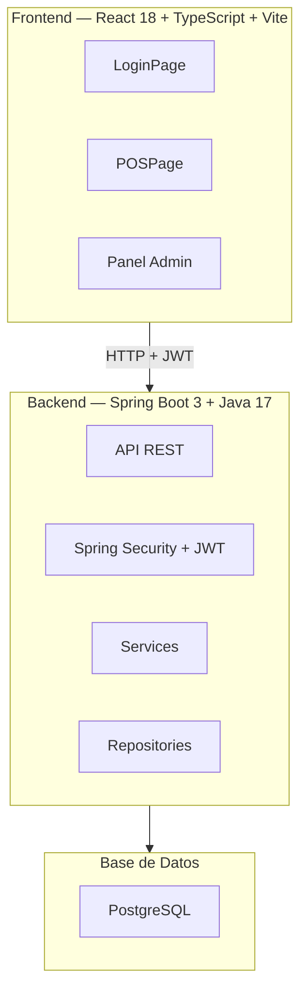
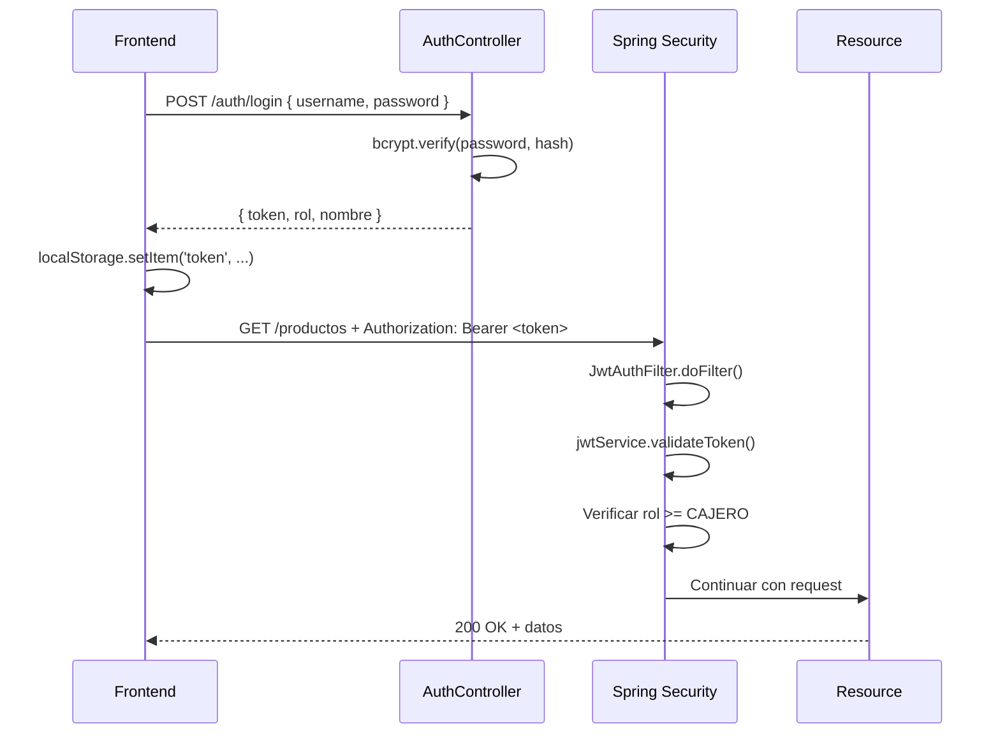

# Documento de Diseño Técnico — Sistema POS Supermercado

## Visión General

Sistema de dos proyectos independientes que se comunican vía REST:



---

## Decisiones de Diseño

| Decisión | Elección | Razón |
|----------|----------|-------|
| Frontend framework | React 18 + TypeScript | Ecosistema maduro, tipado estático |
| Build tool | Vite | HMR rápido, soporte Tailwind v4 |
| Estilos | Tailwind CSS v4 + Glassmorphism | Estética moderna, utility-first |
| Estado POS | useReducer | Carrito complejo con múltiples acciones |
| Atajos teclado | Hook centralizado `useKeyboardShortcuts` | Evita conflictos entre componentes |
| Backend framework | Spring Boot 3.x | Estándar Java, ecosistema maduro |
| Seguridad | Spring Security + jjwt | JWT estándar, integración nativa |
| ORM | Spring Data JPA + Hibernate | Estándar Spring, migraciones Flyway |
| Base de datos | PostgreSQL | Relacional, robusto, open source |

---

## Frontend

### Estructura de Carpetas

```
pos-frontend/
├── src/
│   ├── api/                        # Clientes HTTP por módulo
│   │   ├── client.ts               # Axios + interceptor JWT
│   │   ├── auth.api.ts
│   │   ├── productos.api.ts
│   │   ├── ventas.api.ts
│   │   ├── usuarios.api.ts
│   │   ├── reportes.api.ts
│   │   └── configuracion.api.ts
│   │
│   ├── context/
│   │   ├── AuthContext.tsx          # JWT, usuario, rol
│   │   └── ThemeContext.tsx         # dark/light mode
│   │
│   ├── hooks/
│   │   ├── useKeyboardShortcuts.ts  # F1-F9, M, ↑↓, Del, Esc — CENTRALIZADO
│   │   ├── usePOS.ts                # useReducer del carrito
│   │   ├── useProductos.ts          # React Query
│   │   ├── useVentas.ts
│   │   ├── useUsuarios.ts
│   │   └── useReportes.ts
│   │
│   ├── lib/
│   │   └── calcularTotales.ts       # Lógica pura de IVA — SIN dependencias React
│   │
│   ├── components/
│   │   ├── ui/                      # Componentes base glassmorphism
│   │   │   ├── GlassCard.tsx
│   │   │   ├── GlassInput.tsx
│   │   │   ├── GlassModal.tsx
│   │   │   ├── ThemeToggle.tsx
│   │   │   └── Spinner.tsx          # border-4 border-dashed animate-spin
│   │   │
│   │   ├── layout/
│   │   │   ├── ProtectedRoute.tsx
│   │   │   └── AdminLayout.tsx
│   │   │
│   │   ├── pos/
│   │   │   ├── ProductSearch.tsx    # fieldset + lupa (search.html)
│   │   │   ├── CartList.tsx         # ul > li (Shopping_cart.html)
│   │   │   ├── CartItem.tsx         # li flex items-start justify-between
│   │   │   ├── CartSummary.tsx      # subtotal, IVA, total
│   │   │   ├── KeyboardShortcutsBar.tsx  # referencia visual F1-F9
│   │   │   ├── OverflowMenu.tsx     # dropdown tecla M
│   │   │   ├── PaymentModal.tsx     # F5 — ↑↓ + Enter
│   │   │   ├── WeightModal.tsx      # productos por peso
│   │   │   ├── IVAModal.tsx         # F4 — desglose IVA + descuento
│   │   │   └── TicketModal.tsx      # F7 — window.print()
│   │   │
│   │   ├── productos/
│   │   │   ├── ProductoTable.tsx
│   │   │   └── ProductoForm.tsx
│   │   │
│   │   └── admin/
│   │       ├── BentoCard.tsx        # tarjeta bento para dashboard
│   │       └── ReporteChart.tsx
│   │
│   ├── pages/
│   │   ├── Login.tsx
│   │   ├── POS.tsx                  # página principal del cajero
│   │   ├── Productos.tsx
│   │   ├── Usuarios.tsx
│   │   ├── Reportes.tsx
│   │   └── Configuracion.tsx
│   │
│   ├── types/
│   │   ├── auth.types.ts
│   │   ├── pos.types.ts
│   │   ├── producto.types.ts
│   │   ├── venta.types.ts
│   │   └── config.types.ts
│   │
│   ├── App.tsx
│   ├── main.tsx
│   └── index.css                    # tokens glassmorphism + @media print
```

### Árbol de Componentes — POS

```
POSPage
├── header (navbar con atajos F1-F9)
│   ├── KeyboardShortcutsBar        ← referencia visual permanente
│   └── OverflowMenu (tecla M)      ← atajos secundarios
│
├── grid grid-cols-12               ← estructura.html
│   ├── col-span-3 (izquierda)
│   │   ├── ProductSearch           ← fieldset + lupa (search.html)
│   │   └── panel atajos lateral
│   │
│   ├── col-span-6 (centro)
│   │   └── CartList                ← ul (Shopping_cart.html)
│   │       └── CartItem[]          ← li flex items-start justify-between
│   │
│   └── col-span-3 (derecha)
│       └── CartSummary             ← subtotal, IVA 19%, total
│           └── botón F6 Cobrar
│
├── PaymentModal (F5)               ← ↑↓ + Enter
├── WeightModal                     ← productos por peso
├── IVAModal (F4)                   ← desglose + descuento
└── TicketModal (F7)                ← window.print()
```

### Hook Centralizado de Atajos — `useKeyboardShortcuts`

```typescript
// src/hooks/useKeyboardShortcuts.ts
interface ShortcutConfig {
  key: string
  action: () => void
  disabled?: boolean   // se desactiva cuando hay modal abierto
  description: string
}

// Principio: UN solo event listener global
// Los atajos se desactivan automáticamente cuando modalOpen = true
// excepto Esc que siempre funciona
export function useKeyboardShortcuts(
  shortcuts: ShortcutConfig[],
  modalOpen: boolean
): void
```

**Tabla de atajos:**

| Tecla | Acción | Se desactiva con modal |
|-------|--------|----------------------|
| F1 | Foco al buscador | Sí |
| F2 | Eliminar último ítem | Sí |
| F3 | Limpiar carrito (confirmación) | Sí |
| F4 | Abrir modal IVA/Descuento | Sí |
| F5 | Abrir modal Método de Pago | Sí |
| F6 | Procesar venta | Sí |
| F7 | Imprimir ticket | Solo en TicketModal |
| F8 | Nueva venta | Solo en TicketModal |
| F9 | Cerrar sesión | Sí |
| M | Abrir menú desbordamiento | Sí |
| ↑↓ | Navegar carrito / modal | No |
| Del | Eliminar ítem seleccionado | Sí |
| Enter | Agregar producto | Sí |
| Esc | Cerrar modal activo | No (siempre activo) |

### Lógica Pura de IVA — `calcularTotales`

```typescript
// src/lib/calcularTotales.ts
// Función PURA — sin efectos secundarios, sin dependencias React
// Principio SRP: solo calcula, no renderiza

export interface CartItem {
  precio: number
  cantidad: number
  incluye_iva: boolean
}

export interface Totales {
  subtotalSinIVA: number
  montoIVA: number
  totalConIVA: number
  descuentoMonto: number
}

export function calcularTotales(
  items: CartItem[],
  tasaIVA: number,        // ej: 0.19
  descuentoPct: number    // ej: 0.10 para 10%
): Totales {
  // Si incluye_iva=true: precioBase = precio / (1 + tasaIVA)
  // Si incluye_iva=false: precioBase = precio
  const subtotalSinIVA = items.reduce((acc, item) => {
    const base = item.incluye_iva
      ? item.precio / (1 + tasaIVA)
      : item.precio
    return acc + base * item.cantidad
  }, 0)

  const descuentoMonto = subtotalSinIVA * descuentoPct
  const baseConDescuento = subtotalSinIVA - descuentoMonto
  const montoIVA = baseConDescuento * tasaIVA
  const totalConIVA = baseConDescuento + montoIVA

  return { subtotalSinIVA, montoIVA, totalConIVA, descuentoMonto }
}
```

### Reducer del Carrito — `usePOS`

```typescript
// src/hooks/usePOS.ts
type PosAction =
  | { type: 'ADD_ITEM'; payload: CartItem }
  | { type: 'REMOVE_ITEM'; lineId: string }
  | { type: 'REMOVE_LAST' }
  | { type: 'CLEAR_CART' }
  | { type: 'SET_DESCUENTO'; pct: number }
  | { type: 'SET_METODO_PAGO'; metodo: MetodoPago }
  | { type: 'SET_MONTO_PAGADO'; monto: number }
  | { type: 'SELECT_ITEM'; index: number | null }
  | { type: 'MOVE_SELECTION'; dir: 1 | -1 }
  | { type: 'SET_MODAL'; modal: ModalType | null }
```

### Estilos Glassmorphism — `index.css`

```css
/* src/index.css */
@import "tailwindcss";

@layer components {
  .glass {
    background: rgba(255, 255, 255, 0.10);
    backdrop-filter: blur(16px);
    border: 1px solid rgba(255, 255, 255, 0.18);
  }

  .glass-card {
    background: rgba(255, 255, 255, 0.08);
    backdrop-filter: blur(20px);
    border: 1px solid rgba(255, 255, 255, 0.15);
    border-radius: 1rem;
  }

  .glass-input {
    background: rgba(255, 255, 255, 0.08);
    backdrop-filter: blur(8px);
    border: 1px solid rgba(255, 255, 255, 0.20);
  }

  .glass-modal {
    background: rgba(15, 23, 42, 0.75);
    backdrop-filter: blur(24px);
    border: 1px solid rgba(255, 255, 255, 0.12);
  }

  /* Spinner — loading.html */
  .spinner {
    border: 4px dashed rgba(139, 92, 246, 0.8);
    border-radius: 9999px;
    animation: spin 1s linear infinite;
  }
}

/* Estilos de impresión del ticket */
@media print {
  body > *:not(#ticket-print) { display: none !important; }
  #ticket-print { display: block !important; }
}

/* Formato 80mm */
.print-80mm { width: 80mm; font-family: monospace; font-size: 10pt; }
/* Formato 58mm */
.print-58mm { width: 58mm; font-family: monospace; font-size: 8pt; }
/* Formato carta */
.print-carta { width: 216mm; margin: 2cm; }
```

---

## Backend

### Estructura de Paquetes

```
src/main/java/com/pos/supermarket/
├── auth/
│   ├── AuthController.java         # POST /auth/login
│   ├── AuthService.java
│   ├── JwtService.java             # emisión y validación JWT
│   ├── JwtAuthFilter.java          # filtro Spring Security
│   └── dto/
│       ├── LoginRequest.java
│       └── LoginResponse.java      # { token, rol, nombre }
│
├── productos/
│   ├── ProductoController.java     # GET/POST/PUT/DELETE /productos
│   ├── ProductoService.java
│   ├── ProductoRepository.java
│   ├── Producto.java               # @Entity
│   └── dto/
│       ├── ProductoRequest.java
│       └── ProductoResponse.java
│
├── ventas/
│   ├── VentaController.java        # POST /ventas, GET /ventas/{id}
│   ├── VentaService.java
│   ├── VentaRepository.java
│   ├── VentaItemRepository.java
│   ├── Venta.java                  # @Entity
│   ├── VentaItem.java              # @Entity
│   └── dto/
│       ├── VentaRequest.java
│       ├── VentaItemRequest.java
│       └── VentaResponse.java
│
├── usuarios/
│   ├── UsuarioController.java      # GET/POST/PUT/DELETE /usuarios
│   ├── UsuarioService.java
│   ├── UsuarioRepository.java
│   ├── Usuario.java                # @Entity
│   └── dto/
│       ├── UsuarioRequest.java
│       └── UsuarioResponse.java
│
├── reportes/
│   ├── ReporteController.java      # GET /reportes/ventas
│   ├── ReporteService.java
│   └── dto/
│       └── ReporteVentasResponse.java
│
├── configuracion/
│   ├── ConfiguracionController.java # GET/PUT /configuracion
│   ├── ConfiguracionService.java
│   ├── ConfiguracionRepository.java
│   └── Configuracion.java          # @Entity
│
└── shared/
    ├── SecurityConfig.java         # Spring Security + CORS
    ├── GlobalExceptionHandler.java # @ControllerAdvice
    ├── ApiResponse.java            # wrapper { codigo, mensaje, data }
    └── Rol.java                    # enum CAJERO, SUPERVISOR, ADMIN
```

### Entidades JPA y Esquema PostgreSQL

```sql
-- Flyway: V1__init.sql

CREATE TABLE usuarios (
    id          BIGSERIAL PRIMARY KEY,
    nombre      VARCHAR(100) NOT NULL,
    apellido    VARCHAR(100) NOT NULL,
    username    VARCHAR(50)  NOT NULL UNIQUE,
    password_hash VARCHAR(255) NOT NULL,
    rol         VARCHAR(20)  NOT NULL CHECK (rol IN ('CAJERO','SUPERVISOR','ADMIN')),
    activo      BOOLEAN      NOT NULL DEFAULT TRUE,
    created_at  TIMESTAMP    NOT NULL DEFAULT NOW()
);

CREATE TABLE productos (
    id              BIGSERIAL PRIMARY KEY,
    codigo          VARCHAR(50)    NOT NULL UNIQUE,
    nombre          VARCHAR(200)   NOT NULL,
    descripcion     TEXT,
    categoria       VARCHAR(100),
    precio          NUMERIC(12,2)  NOT NULL,
    incluye_iva     BOOLEAN        NOT NULL DEFAULT FALSE,
    unidad_medida   VARCHAR(20)    NOT NULL DEFAULT 'und',
    activo          BOOLEAN        NOT NULL DEFAULT TRUE,
    created_at      TIMESTAMP      NOT NULL DEFAULT NOW()
);

CREATE TABLE ventas (
    id                  BIGSERIAL PRIMARY KEY,
    numero_venta        VARCHAR(20)   NOT NULL UNIQUE,
    cajero_id           BIGINT        NOT NULL REFERENCES usuarios(id),
    subtotal_sin_iva    NUMERIC(12,2) NOT NULL,
    descuento_pct       NUMERIC(5,2)  NOT NULL DEFAULT 0,
    descuento_monto     NUMERIC(12,2) NOT NULL DEFAULT 0,
    iva_monto           NUMERIC(12,2) NOT NULL,
    total_con_iva       NUMERIC(12,2) NOT NULL,
    metodo_pago         VARCHAR(20)   NOT NULL CHECK (metodo_pago IN ('EFECTIVO','TARJETA','TRANSFERENCIA')),
    monto_recibido      NUMERIC(12,2),
    cambio              NUMERIC(12,2),
    created_at          TIMESTAMP     NOT NULL DEFAULT NOW()
);

CREATE TABLE venta_items (
    id              BIGSERIAL PRIMARY KEY,
    venta_id        BIGINT        NOT NULL REFERENCES ventas(id),
    producto_id     BIGINT        REFERENCES productos(id),
    nombre_producto VARCHAR(200)  NOT NULL,
    cantidad        NUMERIC(10,3) NOT NULL,
    precio_unitario NUMERIC(12,2) NOT NULL,
    incluye_iva     BOOLEAN       NOT NULL,
    subtotal        NUMERIC(12,2) NOT NULL
);

CREATE TABLE configuracion (
    id              BIGSERIAL PRIMARY KEY,
    nombre_negocio  VARCHAR(200) NOT NULL DEFAULT 'Mi Supermercado',
    tasa_iva        NUMERIC(5,4) NOT NULL DEFAULT 0.19,
    formato_papel   VARCHAR(20)  NOT NULL DEFAULT '80mm'
                    CHECK (formato_papel IN ('80mm','58mm','carta')),
    logo_url        TEXT,
    updated_at      TIMESTAMP    NOT NULL DEFAULT NOW()
);

-- Índices para búsqueda rápida de productos
CREATE INDEX idx_productos_codigo ON productos(codigo);
CREATE INDEX idx_productos_nombre ON productos(nombre);
CREATE INDEX idx_ventas_cajero ON ventas(cajero_id);
CREATE INDEX idx_ventas_fecha ON ventas(created_at);
```

### Endpoints REST

| Método | Ruta | Descripción | Rol | Request Body |
|--------|------|-------------|-----|-------------|
| POST | `/auth/login` | Login, emite JWT | Público | `{ username, password }` |
| GET | `/health` | Estado del servicio | Público | — |
| GET | `/productos` | Listar productos (paginado, filtros) | CAJERO+ | — |
| POST | `/productos` | Crear producto | ADMIN | `ProductoRequest` |
| PUT | `/productos/{id}` | Actualizar producto | ADMIN | `ProductoRequest` |
| DELETE | `/productos/{id}` | Desactivar producto | ADMIN | — |
| POST | `/ventas` | Registrar venta | CAJERO+ | `VentaRequest` |
| GET | `/ventas/{id}` | Obtener venta por ID | CAJERO+ | — |
| GET | `/usuarios` | Listar usuarios | ADMIN | — |
| POST | `/usuarios` | Crear usuario | ADMIN | `UsuarioRequest` |
| PUT | `/usuarios/{id}` | Actualizar usuario | ADMIN | `UsuarioRequest` |
| DELETE | `/usuarios/{id}` | Desactivar usuario | ADMIN | — |
| GET | `/reportes/ventas` | Reporte por período | SUPERVISOR+ | `?desde=&hasta=` |
| GET | `/configuracion` | Obtener configuración | CAJERO+ | — |
| PUT | `/configuracion` | Actualizar configuración | ADMIN | `ConfiguracionRequest` |

### Flujo de Seguridad JWT



### Configuración Spring Security

```java
// SecurityConfig.java — rutas públicas vs protegidas
.authorizeHttpRequests(auth -> auth
    .requestMatchers("/auth/login", "/health").permitAll()
    .requestMatchers(HttpMethod.GET, "/productos/**").hasAnyRole("CAJERO","SUPERVISOR","ADMIN")
    .requestMatchers(HttpMethod.POST, "/productos/**").hasRole("ADMIN")
    .requestMatchers(HttpMethod.PUT, "/productos/**").hasRole("ADMIN")
    .requestMatchers(HttpMethod.DELETE, "/productos/**").hasRole("ADMIN")
    .requestMatchers("/ventas/**").hasAnyRole("CAJERO","SUPERVISOR","ADMIN")
    .requestMatchers("/usuarios/**").hasRole("ADMIN")
    .requestMatchers("/reportes/**").hasAnyRole("SUPERVISOR","ADMIN")
    .requestMatchers(HttpMethod.GET, "/configuracion").hasAnyRole("CAJERO","SUPERVISOR","ADMIN")
    .requestMatchers(HttpMethod.PUT, "/configuracion").hasRole("ADMIN")
    .anyRequest().authenticated()
)
```

---

## Propiedades de Corrección

| # | Propiedad | Módulo | Descripción |
|---|-----------|--------|-------------|
| P-01 | Cálculo IVA incluido | Frontend | Para cualquier ítem con `incluye_iva=true`, `precioBase = precio / 1.19` |
| P-02 | Cálculo IVA excluido | Frontend | Para cualquier ítem con `incluye_iva=false`, `montoIVA = precio * 0.19` |
| P-03 | Total con descuento | Frontend | `total = (subtotal - descuento) * (1 + tasaIVA)` |
| P-04 | Cambio no negativo | Frontend | `cambio = max(0, montoRecibido - total)` |
| P-05 | Línea nueva siempre | Frontend | Enter siempre crea línea nueva, nunca acumula en línea existente |
| P-06 | Autorización por rol | Backend | CAJERO no puede POST/PUT/DELETE /productos — siempre HTTP 403 |
| P-07 | Contraseña nunca expuesta | Backend | Ningún endpoint retorna `password_hash` en la respuesta |
| P-08 | Número de venta único | Backend | `numero_venta` tiene constraint UNIQUE en BD |
| P-09 | Producto inactivo no buscable | Backend | `GET /productos` solo retorna `activo=true` |
| P-10 | JWT expirado rechazado | Backend | Token expirado → HTTP 401, Frontend redirige al login |
| P-11 | Atajos desactivados con modal | Frontend | F1-F9 no disparan cuando `modalOpen=true`, excepto Esc |
| P-12 | Ticket refleja venta persistida | Frontend | El ticket muestra exactamente los datos retornados por el Backend |

---

## Estrategia de Testing

### Frontend — Jest + React Testing Library

```
tests/
├── lib/
│   └── calcularTotales.test.ts     # Tests unitarios de lógica pura IVA
├── hooks/
│   ├── usePOS.test.ts              # Tests del reducer del carrito
│   └── useKeyboardShortcuts.test.ts
└── components/
    ├── pos/
    │   ├── CartList.test.tsx
    │   └── PaymentModal.test.tsx
    └── ui/
        └── GlassModal.test.tsx
```

### Backend — JUnit 5 + Mockito

```
src/test/java/com/pos/supermarket/
├── auth/
│   └── AuthServiceTest.java        # login, JWT emisión
├── productos/
│   └── ProductoServiceTest.java    # CRUD, validaciones
├── ventas/
│   └── VentaServiceTest.java       # cálculo IVA, persistencia
└── integration/
    └── PosIntegrationTest.java     # @SpringBootTest flujo completo
```
