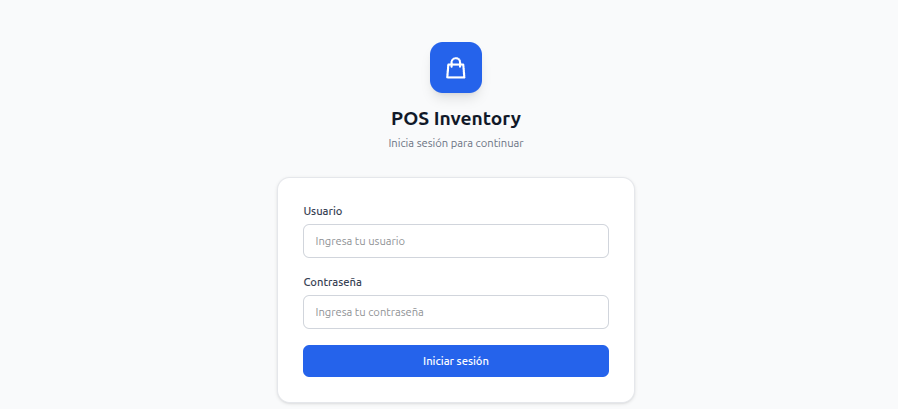

<div align="center">

# 🏪 Inventory POS System

**Sistema completo de gestión de inventario y punto de venta**

Backend serverless en AWS + Frontend React con autenticación JWT

</div>

---

## Capturas de pantalla

| Login | Dashboard |
|-------|-----------|
|  |  |

---

## ¿Qué es esto?

Un sistema para que una startup gestione su inventario y realice ventas en caja. Tiene dos partes que trabajan juntas:

- **Backend** (`serverless-inventory-api/`) — la API que guarda y procesa todos los datos en AWS
- **Frontend** (`pos-frontend/`) — la interfaz web que usan los cajeros y administradores

---

## Estructura del proyecto

```
Kiro/
├── serverless-inventory-api/   ← API REST en AWS (Node.js + Lambda + DynamoDB)
├── pos-frontend/               ← Interfaz web (React + TypeScript + Tailwind)
└── README.md                   ← Este archivo
```

---

## Backend — Serverless Inventory API

### ¿Qué hace?

Expone una API REST que permite:

| Módulo | Qué puedes hacer |
|--------|-----------------|
| `/health` | Verificar que el sistema está funcionando |
| `/productos` | Crear, ver, editar y eliminar productos del inventario |
| `/clientes` | Gestionar la base de datos de compradores |
| `/cobros` | Registrar ventas y descontar stock automáticamente |
| `/creditos` | Asignar saldo a favor a clientes |
| `/stats` | Ver métricas del inventario (stock total, categorías, alertas) |
| `/pos/*` | Abrir caja, registrar ventas y generar tickets |

### Tecnologías

- **Node.js 20** — lenguaje de las funciones
- **AWS SAM** — despliega todo en AWS con un solo comando
- **API Gateway** — recibe las peticiones HTTP
- **Lambda** — ejecuta la lógica de negocio (sin servidor que administrar)
- **DynamoDB** — base de datos NoSQL que escala automáticamente
- **Jest + fast-check** — tests unitarios y property-based testing

### Cómo correrlo localmente

```bash
cd serverless-inventory-api

# Instalar dependencias
npm install

# Correr tests
npm test

# Levantar la API localmente (requiere AWS SAM CLI instalado)
sam build
sam local start-api --port 3000
```

### Cómo desplegarlo en AWS

```bash
cd serverless-inventory-api

# Primera vez (te pregunta región, nombre del stack, etc.)
sam build
sam deploy --guided

# Veces siguientes
sam build && sam deploy
```

### Variables de entorno del backend

Estas se configuran automáticamente al desplegar con SAM. Para desarrollo local, créalas en un archivo `.env`:

| Variable | Para qué sirve |
|----------|---------------|
| `APP_VERSION` | Versión que muestra el health check |
| `ALLOWED_ORIGINS` | Dominios que pueden hacer peticiones (CORS) |
| `JWT_SECRET` | Clave para validar los tokens de autenticación |
| `PRODUCTOS_TABLE` | Nombre de la tabla de productos en DynamoDB |
| `CLIENTES_TABLE` | Nombre de la tabla de clientes |
| `COBROS_TABLE` | Nombre de la tabla de cobros |
| `CREDITOS_TABLE` | Nombre de la tabla de créditos |
| `POS_SESIONES_TABLE` | Nombre de la tabla de sesiones de caja |
| `POS_VENTAS_TABLE` | Nombre de la tabla de ventas |

---

## Frontend — POS Interface

### ¿Qué hace?

Una aplicación web que consume el backend y permite:

- **Login seguro** con usuario y contraseña (JWT)
- **Ver y buscar productos** con filtros por categoría y paginación
- **Gestionar clientes** — crear, editar, eliminar
- **Registrar cobros** con descuento automático de stock
- **Asignar créditos** a clientes
- **Punto de venta** — abrir caja, armar carrito, cobrar y generar ticket
- **Dashboard** con métricas del inventario

### Tecnologías

- **React 18 + TypeScript** — interfaz de usuario
- **Vite** — herramienta de desarrollo rápida
- **Tailwind CSS v4** — estilos
- **React Router v7** — navegación entre páginas
- **React Query** — manejo de datos del servidor (cache, loading, errores)
- **Axios** — peticiones HTTP con JWT automático
- **React Hook Form + Zod** — formularios con validación

### Cómo correrlo

```bash
cd pos-frontend

# Instalar dependencias
npm install

# Crear archivo de configuración
cp .env.example .env
# Edita .env y pon la URL de tu backend:
# VITE_API_URL=http://localhost:3000

# Levantar en modo desarrollo
npm run dev
```

Abre `http://localhost:5173` en tu navegador.

### Cómo construir para producción

```bash
cd pos-frontend
npm run build
# Los archivos listos para subir quedan en dist/
```

---

## Flujo completo de uso

```
1. El cajero abre el navegador → ve la pantalla de login
2. Ingresa usuario y contraseña → el backend valida y devuelve un token JWT
3. El frontend guarda el token y lo envía en cada petición automáticamente
4. El cajero puede ver productos, registrar ventas, gestionar clientes, etc.
5. Al cerrar sesión, el token se elimina y vuelve al login
```

---

## Prerrequisitos para desarrollo

| Herramienta | Para qué |
|-------------|---------|
| Node.js 20+ | Correr el frontend y el backend |
| AWS CLI | Configurar credenciales de AWS |
| AWS SAM CLI | Desplegar y probar el backend localmente |
| Cuenta AWS | Donde se despliega el backend |

---

## Estado del proyecto

| Componente | Estado |
|-----------|--------|
| Backend — Dominio y entidades | ✅ Completo |
| Backend — Repositorios DynamoDB | 🔄 En progreso |
| Backend — Handlers Lambda | ⏳ Pendiente |
| Backend — Template SAM | ⏳ Pendiente |
| Frontend — Login y autenticación | ✅ Completo |
| Frontend — Listado de productos | ✅ Completo |
| Frontend — CRUD completo | ⏳ Pendiente |
| Frontend — Módulo POS | ⏳ Pendiente |

---

<div align="center">
  Construido con Node.js 20 · AWS SAM · React 18 · Tailwind CSS v4
</div>
