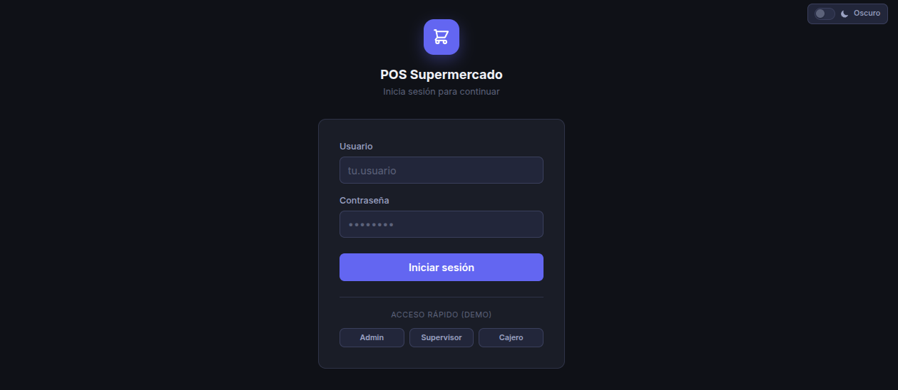
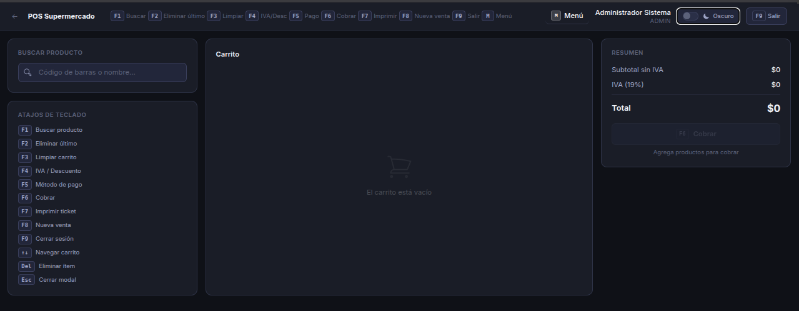
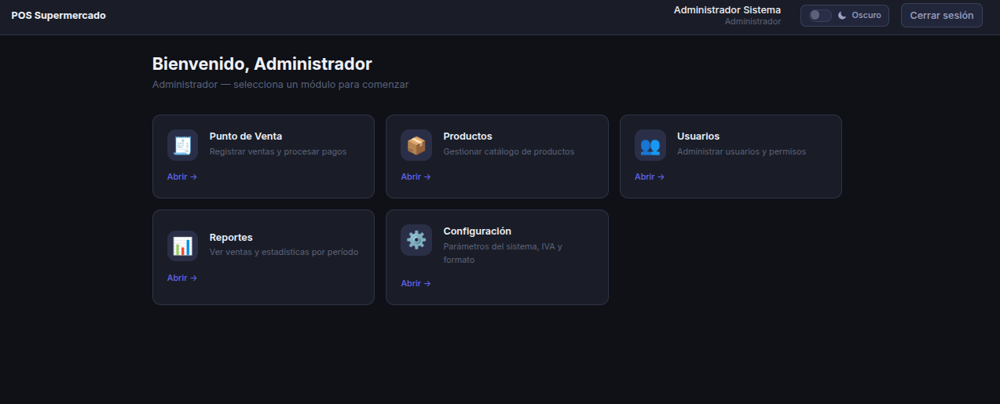
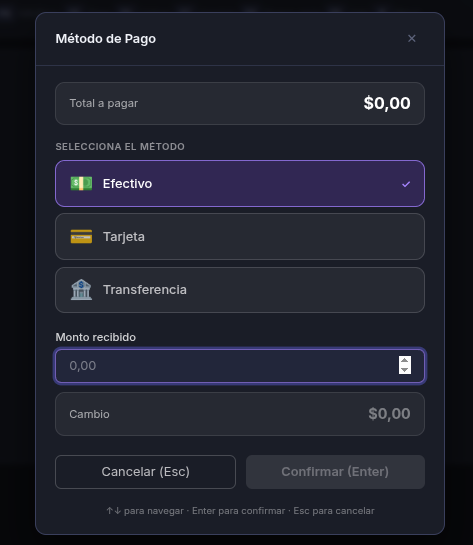
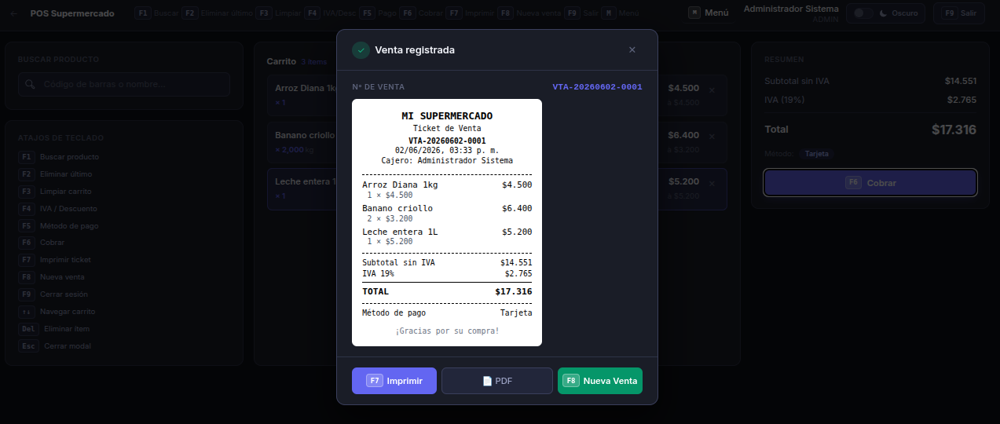
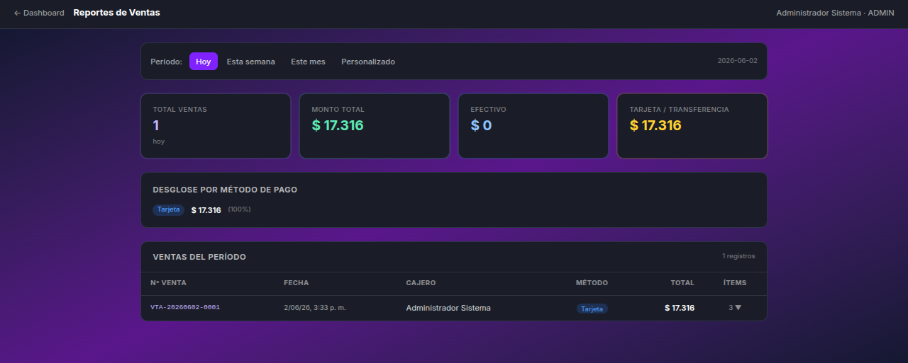
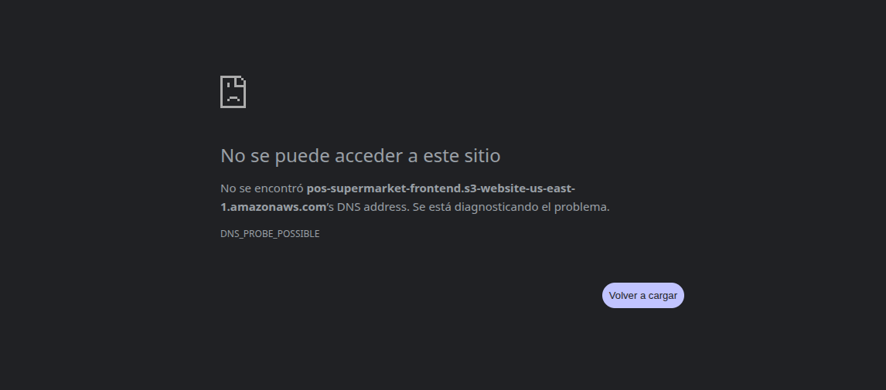

# 🛒 POS Supermercado

Sistema de Punto de Venta web para supermercado, construido con enfoque **Spec-Driven Development (SDD)**. Arquitectura cliente-servidor desacoplada: frontend React desplegado en S3 y backend serverless en AWS Lambda + API Gateway + DynamoDB.

**Frontend en producción:** [http://pos-supermarket-frontend.s3-website-us-east-1.amazonaws.com/pos](http://pos-supermarket-frontend.s3-website-us-east-1.amazonaws.com/pos)
**API en producción:** `https://6ant23fjfk.execute-api.us-east-1.amazonaws.com`

---

## Arquitectura del sistema

```
Usuario (navegador)
      │
      ▼
React SPA (S3 / localhost:5173)
      │  HTTP + JWT
      ▼
API Gateway (HTTP API)
      │
      ├── /auth/login   → Lambda: login.mjs
      ├── /productos     → Lambda: productos.mjs
      ├── /ventas        → Lambda: ventas.mjs
      ├── /usuarios      → Lambda: usuarios.mjs
      ├── /reportes      → Lambda: reportes.mjs
      ├── /configuracion → Lambda: configuracion.mjs
      └── /health        → Lambda: health.mjs
                │
                ▼
           DynamoDB
     pos-usuarios-prod
     pos-productos-prod
     pos-ventas-prod
     pos-configuracion-prod
```

El **frontend** (React) es responsable de la interfaz de usuario, la navegación por teclado, el cálculo de IVA en tiempo real y la presentación de datos. El **backend** (Lambda) es responsable de la autenticación, la autorización por roles, la persistencia en DynamoDB y la validación de negocio. Ninguno de los dos asume responsabilidades del otro.

---

## Framework elegido: React 18 + TypeScript

**Justificación técnica:**

| Característica | Ventaja en este proyecto |
|----------------|--------------------------|
| `useReducer` | El carrito del POS tiene 10+ acciones atómicas — un reducer centraliza el estado sin librerías externas |
| Hooks (`useState`, `useEffect`) | El ciclo de vida de los modales y búsqueda asíncrona se expresan de forma declarativa |
| TypeScript | Las interfaces `CartItem`, `Venta`, `Producto` previenen errores en tiempo de compilación antes de llegar a la API |
| Vite | HMR instantáneo durante desarrollo + build optimizado para S3 |
| Composición de componentes | El POS se divide en `ProductSearch`, `CartList`, `CartSummary`, modales — cada uno con responsabilidad única |

---

## Capturas de pantalla

### Login


### Punto de Venta (POS)


### Listado de productos cargado desde el API


### Modal de pago


### Registro de venta exitosa — ticket generado


### Módulo de reportes


### Manejo de error


---

## Proceso SDD — Cómo los specs guiaron la implementación

Este proyecto siguió el enfoque **Spec-Driven Development**: los documentos de especificación se escribieron **antes** de cualquier línea de código y sirvieron como contrato durante toda la implementación.

### 1. `requirements.md` — El "qué"
Definimos 12 requisitos funcionales con criterios de aceptación en formato estructurado (`THE system SHALL...`). Ejemplo del Requisito 2:

> *"WHEN el cajero presiona Enter sobre un producto, THE Frontend SHALL agregar una nueva línea individual al Carrito sin acumular en líneas existentes."*

Este criterio derivó directamente en la acción `ADD_ITEM` del reducer, que usa `nanoid()` para garantizar una línea nueva siempre — nunca acumula.

### 2. `design.md` — El "cómo"
Antes de crear ningún componente, diseñamos:
- El árbol de componentes del POS (`POSPage → CartList → CartItem[]`)
- La firma de `calcularTotales(items, tasaIVA, descuentoPct): Totales` como función pura
- La tabla de atajos de teclado y el contrato del hook `useKeyboardShortcuts`
- El esquema de tablas DynamoDB con sus GSIs

El diseño previo evitó refactorizaciones costosas: el layout de 12 columnas y la separación de responsabilidades entre componentes se respetó desde el inicio.

### 3. `tasks.md` — El "cuándo"
Las tareas se organizaron en 8 fases progresivas (setup → auth → backend core → UI base → POS → modales → admin → testing). Cada tarea referencia el requisito que satisface. Esto permitió verificar cobertura: si una tarea no referenciaba ningún requisito, se eliminaba; si un requisito no tenía tarea, se agregaba.

### Resultado
Los specs funcionaron como documentación viva: cuando el comportamiento del carrito fue ambiguo durante el desarrollo, la respuesta siempre estuvo en el `requirements.md`, no en suposiciones.

---

## Estructura del repositorio

```
├── .kiro/
│   └── specs/
│       ├── supermarket-pos/          # Specs en español
│       │   ├── requirements.md
│       │   ├── design.md
│       │   └── tasks.md
│       └── supermarket-pos-en/       # Specs en inglés
│           ├── requirements.md
│           ├── design.md
│           └── tasks.md
├── pos-frontend/                     # React 18 + TypeScript + Vite
│   ├── src/
│   │   ├── api/                      # Clientes HTTP por módulo
│   │   ├── components/               # Componentes UI
│   │   │   ├── pos/                  # Componentes del POS
│   │   │   ├── ui/                   # GlassCard, GlassModal, etc.
│   │   │   └── layout/               # ProtectedRoute
│   │   ├── context/                  # AuthContext, ConfigContext
│   │   ├── hooks/                    # usePOS, useKeyboardShortcuts
│   │   ├── lib/                      # calcularTotales (lógica pura)
│   │   ├── pages/                    # Login, POS, Productos, etc.
│   │   └── types/                    # Interfaces TypeScript
│   ├── .env                          # VITE_API_URL (desarrollo)
│   └── .env.production               # VITE_API_URL (producción AWS)
├── serverless-inventory-api/         # Node.js 20 + AWS SAM
│   ├── src/
│   │   ├── handlers/                 # Funciones Lambda
│   │   ├── lib/                      # auth, dynamo, jwt, http
│   │   └── tests/                    # Tests unitarios
│   ├── scripts/                      # seed.mjs, seed-aws.mjs
│   └── template.yaml                 # Infraestructura SAM
├── db/
│   └── dynamodb/seed/                # Datos de prueba JSON
├── docs/
│   └── screenshots/                  # Capturas del sistema
└── README.md
```

---

## Ejecutar localmente

### Prerrequisitos
- Node.js >= 20
- Docker (para DynamoDB Local)

### 1. Clonar el repositorio

```bash
git clone <url-del-repo>
cd <nombre-del-repo>
```

### 2. Backend

```bash
cd serverless-inventory-api
npm install

# Primera vez: levantar DynamoDB Local, crear tablas y cargar datos
npm run setup:local

# Iniciar servidor (emula API Gateway en :3000)
npm run dev
```

### 3. Frontend

```bash
cd pos-frontend
npm install
npm run dev
# App disponible en http://localhost:5173
```

### 4. Configurar la URL del API

El archivo `pos-frontend/.env` contiene:

```env
VITE_API_URL=http://localhost:3000
```

Para apuntar a la API en AWS, edita `.env.production`:

```env
VITE_API_URL=https://6ant23fjfk.execute-api.us-east-1.amazonaws.com
```

> La URL nunca está hardcodeada en el código — siempre se lee de `import.meta.env.VITE_API_URL` a través del cliente Axios centralizado en `src/api/client.ts`.

### Usuarios de prueba (desarrollo local)

| Usuario | Contraseña | Rol |
|---------|-----------|-----|
| `admin` | `admin123` | ADMIN |
| `supervisor` | `supervisor123` | SUPERVISOR |
| `cajero` | `cajero123` | CAJERO |

---

## Atajos de teclado del POS

| Tecla | Acción |
|-------|--------|
| `F1` | Foco al buscador de productos |
| `F2` | Eliminar último ítem del carrito |
| `F3` | Limpiar carrito (pide confirmación) |
| `F4` | Abrir modal IVA / Descuento |
| `F5` | Abrir modal Método de Pago |
| `F6` | Procesar venta |
| `F7` | Imprimir ticket |
| `F8` | Nueva venta |
| `F9` | Cerrar sesión |
| `M` | Menú de opciones adicionales |
| `↑ ↓` | Navegar ítems del carrito |
| `Del` | Eliminar ítem seleccionado |
| `Esc` | Cerrar modal activo |

---

## Despliegue en AWS

### Backend (AWS SAM)

```bash
cd serverless-inventory-api
sam build
sam deploy --config-file samconfig.toml
```

SAM despliega automáticamente: API Gateway + 7 Lambdas + 4 tablas DynamoDB + roles IAM.

Cargar datos iniciales en AWS:

```bash
STAGE=prod npm run seed:aws
```

### Frontend (S3)

```bash
cd pos-frontend
npm run build
aws s3 sync dist/ s3://pos-supermarket-frontend --delete
aws s3 website s3://pos-supermarket-frontend \
  --index-document index.html \
  --error-document index.html
```

---

## Tests

```bash
# Frontend (37 tests — IVA, carrito, atajos)
cd pos-frontend && npm test

# Backend (31 tests — auth, autorización por rol, ventas)
cd serverless-inventory-api && npm test
```

---

## Evaluación técnica — Hallazgos

Como evaluación honesta del estado actual del proyecto:

- `npm run lint` sigue fallando por deuda técnica real en React/ESLint, sobre todo en `useKeyboardShortcuts.ts` (línea 38), `IVAModal.tsx` (línea 31), `PaymentModal.tsx` (línea 42) y `ConfigContext.tsx` (línea 46). No rompe el MVP, pero sí le baja puntos de portafolio.
- El frontend compila bien, pero el bundle final quedó en aproximadamente `504 kB`, así que todavía hay espacio para pulir performance antes de venderlo como un proyecto “muy sólido”.
- Hay detalles de tooling todavía verdes: una regla `jsx-a11y` faltante y warnings de Fast Refresh/React Compiler. Eso da sensación de proyecto bueno, pero no totalmente rematado.

---

## Fundamentos técnicos aplicados

### HTML5 semántico
Los componentes React generan markup semántico: `<header>`, `<main>`, `<section>`, `<ul>/<li>` para el carrito, `<fieldset>/<label>` para el buscador, `<button>` con `aria-label` para acciones.

### CSS — Flexbox y Grid
El layout del POS usa CSS Grid de 12 columnas (`grid-cols-12`). Los componentes internos usan Flexbox (`flex items-start justify-between`). Los estilos glassmorphism están definidos como clases reutilizables en `index.css` con `backdrop-filter`, `background rgba` y `border`.

### JavaScript asíncrono
Todas las llamadas al API usan `async/await` con `try/catch`:

```javascript
// src/api/client.ts — instancia Axios centralizada
const client = axios.create({
  baseURL: import.meta.env.VITE_API_URL,
})

// src/api/productos.api.ts
export async function buscarProductos(q: string) {
  try {
    const { data } = await client.get(`/productos?q=${q}`)
    return data
  } catch (error) {
    throw new Error('Error al buscar productos')
  }
}
```
