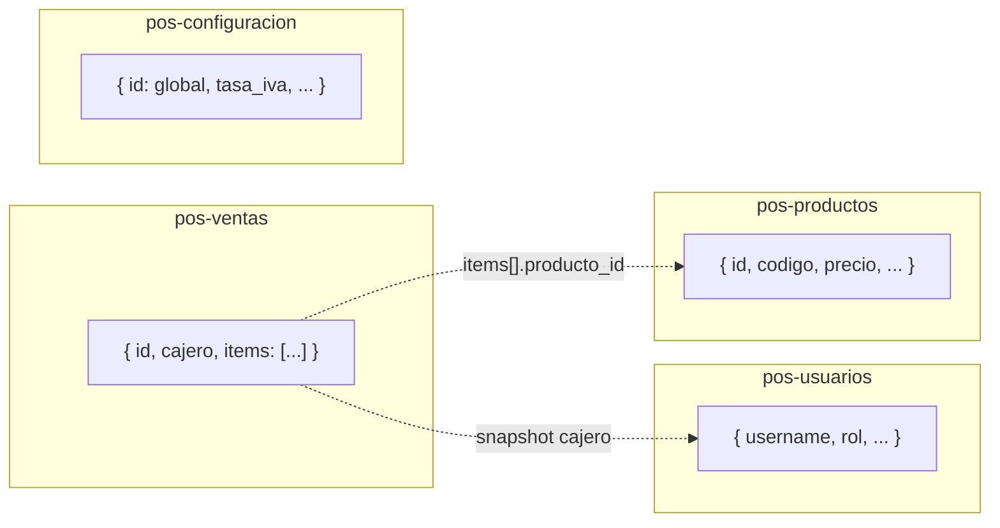

# DynamoDB — Esquema no relacional (JSON)

El sistema POS **no usa tablas relacionales** ni JOINs. Cada entidad es un **documento JSON** en DynamoDB. Las ventas guardan sus ítems **embebidos** en el mismo registro.

## Decisión vs PostgreSQL (anterior)

| Antes (PostgreSQL) | Ahora (DynamoDB) |
|--------------------|------------------|
| `usuarios`, `productos`, `ventas`, `venta_items`, `configuracion` | 4 tablas independientes |
| FK `venta_items.venta_id → ventas.id` | Array `items[]` dentro del JSON de la venta |
| Flyway SQL | Archivos JSON en `db/dynamodb/seed/` |
| Spring Data JPA | AWS SDK / repositorios en Lambda (Node.js) |

## Tablas

### 1. `pos-usuarios`

| Atributo | Tipo | Descripción |
|----------|------|-------------|
| **PK** `username` | String | Login único |
| `id` | String | UUID interno (`usr-xxx`) |
| `nombre`, `apellido` | String | |
| `password_hash` | String | bcrypt — **nunca** se expone en API |
| `rol` | String | `CAJERO` \| `SUPERVISOR` \| `ADMIN` |
| `activo` | Boolean | |
| `created_at` | String | ISO-8601 |

**Consultas:** login por `username` (GetItem). Listado: Scan o GSI por `rol` si se necesita.

---

### 2. `pos-productos`

| Atributo | Tipo | Descripción |
|----------|------|-------------|
| **PK** `id` | String | `prod-xxx` |
| `codigo` | String | Código de barras / SKU |
| `nombre`, `descripcion`, `categoria` | String | |
| `precio` | Number | |
| `incluye_iva` | Boolean | |
| `unidad_medida` | String | `und`, `kg`, `g`, `lb` |
| `activo` | Boolean | |
| `created_at` | String | ISO-8601 |

**GSI `codigo-index`:** PK = `codigo` → búsqueda rápida en POS (F1 / Enter).

**GSI `activo-index`:** PK = `activo` (String `"true"`/`"false"`), SK = `nombre` → listar solo activos.

---

### 3. `pos-ventas`

| Atributo | Tipo | Descripción |
|----------|------|-------------|
| **PK** `id` | String | `venta-xxx` |
| `numero_venta` | String | Ej. `VTA-20260526-0001` |
| `cajero` | Map | `{ id, username, nombre }` — snapshot, sin FK |
| `subtotal_sin_iva`, `descuento_pct`, `descuento_monto` | Number | |
| `iva_monto`, `total_con_iva` | Number | |
| `metodo_pago` | String | `EFECTIVO` \| `TARJETA` \| `TRANSFERENCIA` |
| `monto_recibido`, `cambio` | Number | opcional |
| `created_at` | String | ISO-8601 |
| **`items`** | **List** | Array de objetos JSON (líneas del ticket) |

Cada ítem embebido:

```json
{
  "producto_id": "prod-001",
  "nombre_producto": "Arroz 1kg",
  "cantidad": 2,
  "precio_unitario": 3500,
  "incluye_iva": true,
  "subtotal": 7000
}
```

**GSI `numero-venta-index`:** PK = `numero_venta`.

**GSI `fecha-index`:** PK = `fecha` (`YYYY-MM-DD`), SK = `created_at` → reportes por rango.

---

### 4. `pos-configuracion`

Un solo documento por negocio (PK fija).

| Atributo | Tipo | Descripción |
|----------|------|-------------|
| **PK** `id` | String | Siempre `"global"` |
| `nombre_negocio` | String | |
| `tasa_iva` | Number | Ej. `0.19` |
| `formato_papel` | String | `80mm` \| `58mm` \| `carta` |
| `logo_url` | String | opcional |
| `updated_at` | String | ISO-8601 |

---

## Diagrama (documentos, no relaciones)



Las líneas punteadas son **referencias lógicas en JSON**, no foreign keys.

## Seed inicial

Archivos en [`db/dynamodb/seed/`](../db/dynamodb/seed/):

- `usuarios.json` — admin, supervisor, cajero (demo)
- `productos.json` — catálogo de ejemplo
- `configuracion.json` — negocio por defecto
- `ventas.json` — vacío `[]` (las ventas se crean en runtime)

## Comandos locales

Ver [`serverless-inventory-api/README.md`](../../serverless-inventory-api/README.md) para DynamoDB Local + script de seed.
